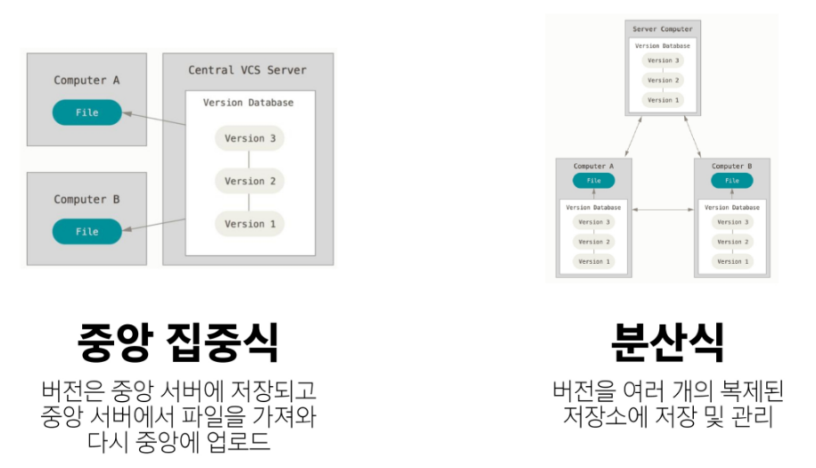

# 🌱 TIL: 스타트캠프 파이썬 트랙 (Day1)

> 작성일: 2025년 7월 16일

---

## 🖥 운영체제 & 터미널

- OS마다 터미널 명령어가 다르므로 주의
- Windows: `cmd`
- Unix: `bash` (우리는 Git Bash 사용)

---

## 📂 기본 명령어 요약

| 명령어       | 설명                                              |
|--------------|---------------------------------------------------|
| `.`          | 현재 디렉토리                                     |
| `..`         | 상위 디렉토리 (부모 폴더)                         |
| `touch`      | 파일 생성                                         |
| `mkdir`      | 디렉토리 생성                                     |
| `ls`         | 디렉토리 내부 목록 출력                           |
| `cd`         | 디렉토리 이동                                     |
| `start`      | 파일/폴더 열기 (Mac은 `open`)                     |
| `rm`         | 파일 삭제 (디렉토리 삭제는 `-r` 옵션과 함께)     |
| `pwd`        | 현재 디렉토리의 절대 경로 출력                    |
| `clear`      | 터미널 명령어 화면 지우기 (단축키: Ctrl + L)     |

---

## 📌 경로의 개념

- **루트 디렉토리 `/`**: 모든 경로의 시작
- **홈 디렉토리 `~`**: 기본 시작 경로
- **절대 경로**: 루트부터 목적지까지 전체 경로
- **상대 경로**: 현재 위치를 기준으로 한 경로

---

## 📝 Markdown 문법 기초

```markdown
# 제목
## 부제목
- 리스트
1. 순서 있는 리스트
**굵게**, *기울임*, ~~취소선~~
```

> 텍스트 기반 문서 작성 방식. 주로 개발 문서 및 README에 활용.

```python
print('hello')  # 파이썬
```

```cpp
cout << "hello"; // C++
```

[Google](https://www.google.com/)

---

## 🔧 Git 기초

### Git이란?

- 분산 버전 관리 시스템(DVCS)
- 코드의 변경 이력을 추적하고 협업을 쉽게 해주는 도구

### Git의 영역

- **Working Directory**: 실제 작업 영역
- **Staging Area**: 커밋할 파일을 임시로 저장
- **Repository**: 커밋된 모든 이력이 저장되는 공간

```
작업 → git add → git commit
```

### 주요 명령어

| 명령어 | 설명 |
|--------|------|
| `git init` | Git 저장소 초기화 |
| `git add` | 변경된 파일을 Staging Area에 추가 |
| `git commit` | 스냅샷(버전) 생성 |
| `git status` | 현재 파일 상태 확인 |
| `git rm --cached <파일>` | 스테이징에서 파일 제거 |
| `git log` | 커밋 히스토리 확인 |
| `git log --oneline` | 간략히 커밋 확인 |
| `git config --global user.name/email` | 사용자 설정 |

---

## 💡 Git 기타 지식

- **commit = 버전**
- `git commit --amend`: 최근 커밋 수정
- `.git` 폴더가 생성되면 해당 디렉토리는 Git 저장소
- 저장소 중첩 금지 (하위 폴더에 또 `git init` 금지)
- 저장소 제거는 `.git` 폴더 삭제

---

## 🧠 기타 참고

- `code .`: 현재 디렉토리를 VSCode에서 열기
- **Vim 모드 전환**
    - `i`: 입력 모드 진입
    - `ESC`: 명령 모드 진입
    - `:wq`: 저장 후 종료

---

## 📷 이미지 정리

  
*중앙 집중식과 분산형 저장소 차이*

  
*Git의 작업 흐름 영역*

  
*파일을 버전으로 만들기까지의 흐름*

  
*버전(커밋)은 스냅샷 개념으로 기록됨*

---

## ✅ 정리

- Git은 개발자의 필수 도구
- 버전 관리는 협업과 오류 복구의 핵심
- Markdown은 문서화에 필수적인 표현 언어

-끝-
